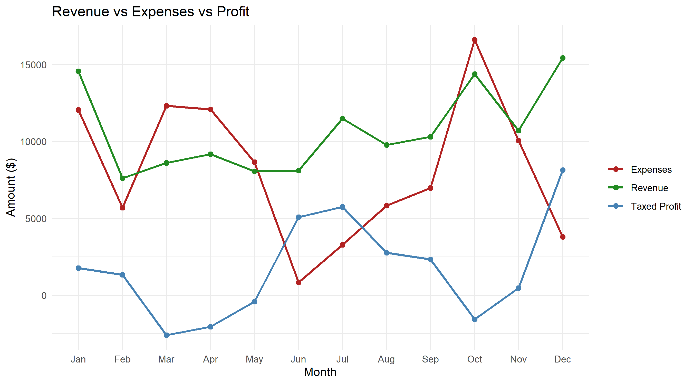
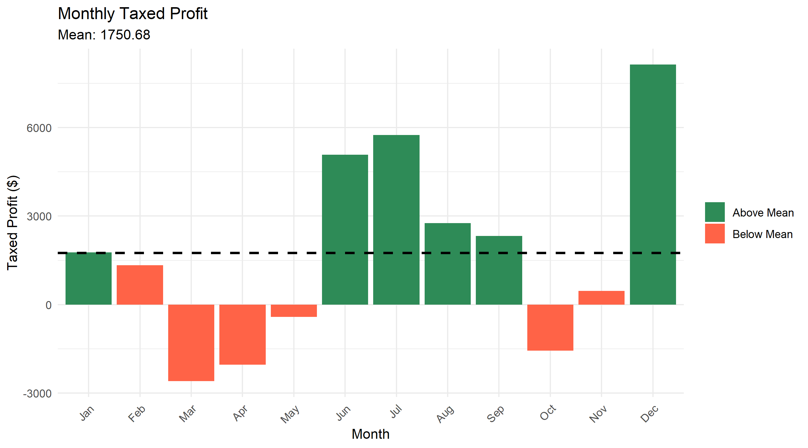
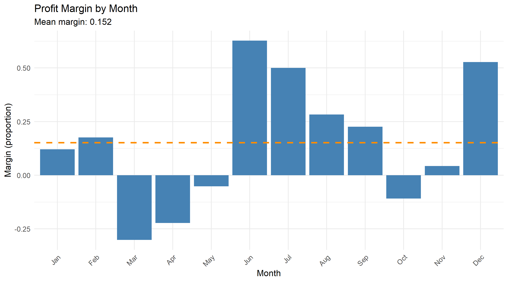
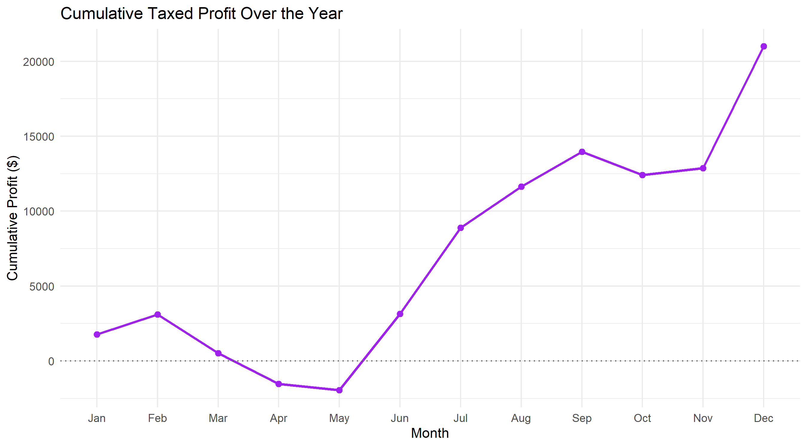

# Financial Statement Analysis

## Scenario

You are a data scientist working for a consulting firm. One of your colleagues from the Auditing department has asked you to help them assess the financial statement of organization X.

You have been supplied with two vectors of data: monthly revenue and monthly expenses for the financial year in question.

Your task is to calculate the following financial metrics:

* Profit for each month
* Profit after tax for each month
* Profit margin for each month - equals to profit after tax divided by the revenue
* Good months - where the profit after tax was greater than the mean of the year
* Bad months - where the profit after tax was lesser than the mean of the year
* The best month - where the profit after tax was max for the year
* The worst month - where the profit after tax was the min for the year

All results need to be presented as vectors.

Results for the profit margin ratio needs to be presented in units of % with no decimal points.

Results for dollar values need to be calculated with \$0.01 precision, but need to be presented in units of \$1000 (i.e. 1k) with no decimal points.

> **Note:** Your colleague has warned you that it is okay for tax for any given month to be negative (in accounting terms, negative tax translates into a deferred tax asset).

## Visualizations

To make the financial trends easier to interpret at a glance, four charts are generated using `ggplot2` and saved to `assets/images/`.

### 1. Revenue vs Expenses vs Profit

Line chart comparing monthly revenue, expenses, and taxed profit across the year. Revenue and expenses swing widely and often move together, but expenses spike close to (and sometimes above) revenue in months like March, April, and October, which is why taxed profit dips or goes negative around those points. From June onward the gap between revenue and expenses widens noticeably, driving profit up towards a strong finish in December.

### 2. Monthly Taxed Profit

Bar chart of taxed profit per month, color-coded by whether the month performed above (green) or below (red) the yearly mean of $1,750.68, with a dashed line marking that mean. March and April stand out as the weakest months, both well below the mean with losses, while June, July, and December are the standout performers, each comfortably clearing the mean.

### 3. Profit Margin by Month

Bar chart of profit margin per month, with a dashed line marking the average margin for the year (15.2%). The pattern mirrors the taxed profit chart: March and April post the deepest negative margins, while June and December post the highest, both exceeding 50% of revenue retained as profit after tax.

### 4. Cumulative Taxed Profit Over the Year

Line chart tracking the running total of taxed profit month over month. The cumulative total dips into negative territory between March and May as early losses accumulate, then recovers sharply from June, climbing steadily for the rest of the year and closing at its highest point in December - evidence of a strong second-half turnaround despite the rocky start.

### Source
You can find the code for this project [here](./financials.R).
