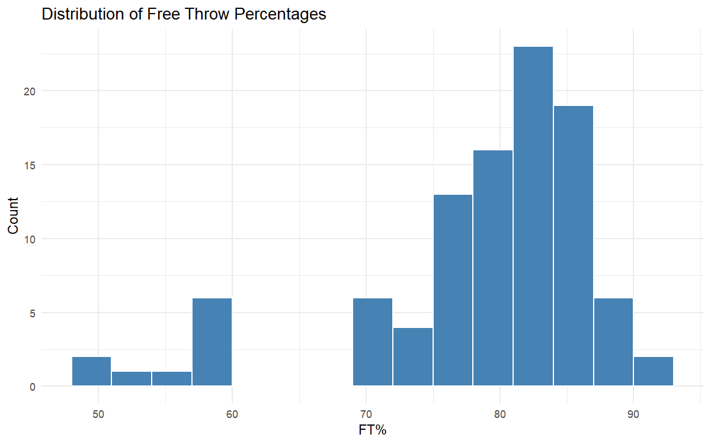
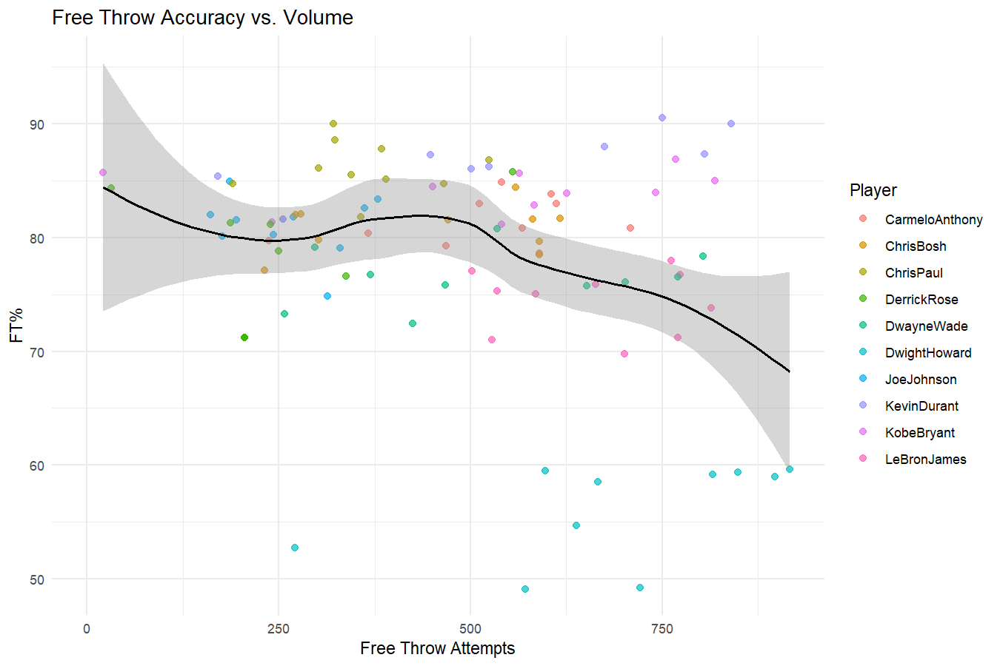
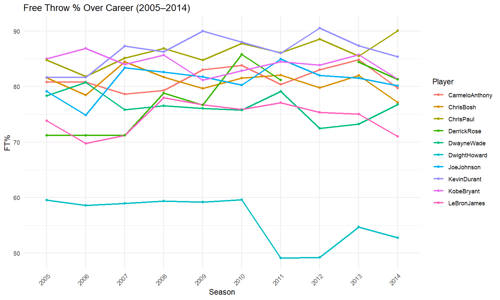
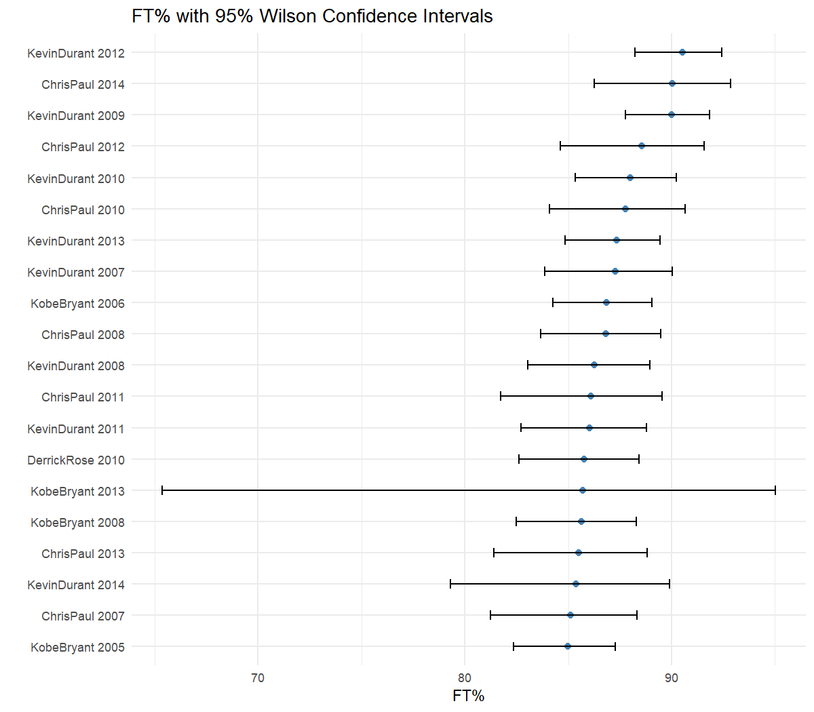
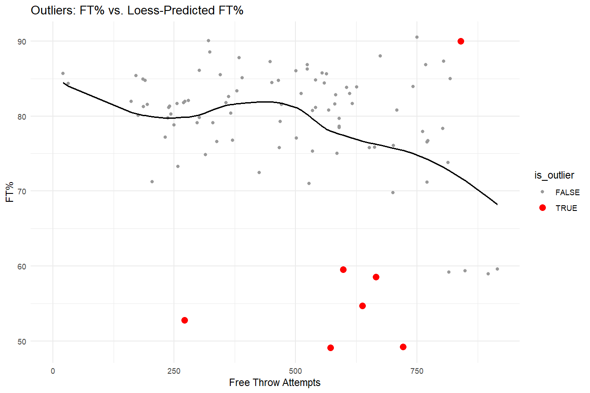
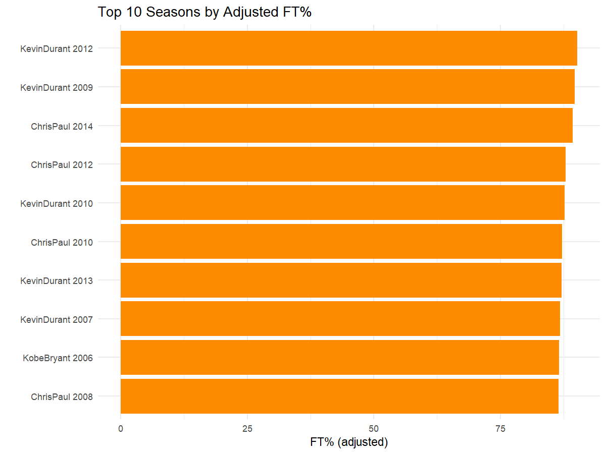

# NBA Free Throw Analysis

A short statistical study of free throw shooting for 10 NBA players across the 2005-2014 seasons.

## Dataset

The raw data consists of season-by-season free throws made (`FT`) and free throw attempts (`FTA`) for 10 players: Kobe Bryant, Joe Johnson, LeBron James, Carmelo Anthony, Dwight Howard, Chris Bosh, Chris Paul, Kevin Durant, Derrick Rose, and Dwayne Wade, covering 10 seasons (2005 to 2014) each.

These were reshaped into a single tidy data frame (`ft_df`) with 100 rows, one per player-season, containing:

| Column | Description |
|---|---|
| `Player` | Player name |
| `Season` | Year (ordered factor, 2005-2014) |
| `FT` | Free throws made |
| `FTA` | Free throw attempts |
| `FT_pct` | Raw free throw percentage (`FT / FTA * 100`) |
| `FT_pct_adj` | Shrinkage-adjusted FT%, pulled toward the league average based on attempt volume |
| `CI_lower`, `CI_upper` | 95% Wilson confidence interval bounds for FT% |
| `predicted_pct`, `residual`, `is_outlier` | Loess-based prediction and outlier flag |

Note: Derrick Rose's 2012 season has 0 attempts (injury year), so `FT_pct` is `NA` for that row; all other computations handle this case explicitly.

## Concepts Computed

- **League average**: overall FT% across all players and seasons, used as a shrinkage prior.
- **Adjusted FT%**: a shrinkage estimator that pulls low-volume seasons toward the league average, so a handful of lucky or unlucky attempts don't distort the ranking.
- **Wilson confidence intervals**: quantify the uncertainty around each season's FT%, since a percentage from 30 attempts is far less reliable than one from 800.
- **Outlier detection**: a loess curve models the expected FT% given attempt volume; players whose actual FT% deviates more than 2 standard deviations from that curve are flagged.

## Plots and Findings

### FT Distribution

Histogram of all FT% values. The distribution is left-skewed with two clusters: most seasons sit between 75% and 90%, while a small, separate cluster around 50-60% belongs almost entirely to one player (Dwight Howard).

### Volume vs Accuracy

FT% plotted against attempts, with a loess trend line. Most players cluster between 75% and 90% regardless of volume; Dwight Howard sits far below the pack even at high attempt counts, pulling the overall trend line downward at the high-volume end.

### Career Trend

FT% over time for each player. Most players hover in a stable 75-90% band across their careers. Dwight Howard's line sits consistently below everyone else and drops sharply after 2010; Derrick Rose's line breaks in 2012, matching his injury-shortened season.

### Confidence Intervals

Top 20 seasons by raw FT%, shown with 95% confidence intervals. High-volume seasons (Kevin Durant, Chris Paul) have narrow intervals, meaning we can trust those percentages closely. Low-volume seasons like Kobe Bryant 2013 (27/32) have a very wide interval, showing the raw percentage there is not very reliable.

### Outliers

FT% vs. attempts with outlier seasons highlighted in red. All of Dwight Howard's seasons are flagged as outliers on the low end. Kevin Durant's 2009 season (90% on 840 attempts) is flagged as a positive outlier, standing out as unusually accurate for that volume.

### Top N

Top 10 seasons by adjusted FT% (minimum 50 attempts). Kevin Durant and Chris Paul dominate the list, each appearing multiple times, confirming them as the most consistently accurate high-volume free throw shooters in this dataset.

## Summary

The main pattern in this dataset is a clear split between two groups: a tight cluster of accurate shooters (Durant, Paul, Bryant, Anthony, Bosh) sitting around 75-90%, and Dwight Howard, whose FT% sits 15-25 points below what his attempt volume would predict. Adjusting for sample size and computing confidence intervals both confirm that low-attempt seasons should be interpreted cautiously, while Durant and Paul's high percentages are well-supported by large sample sizes.

### Source
You can find the code for this project [here](./free_throws.R).