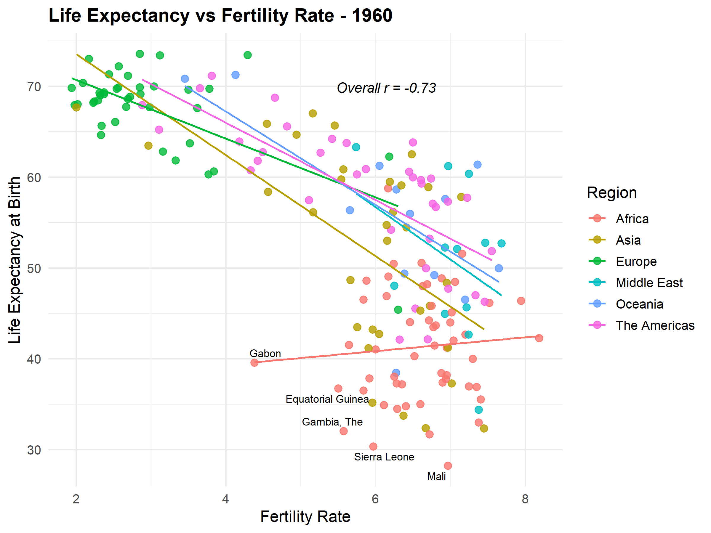
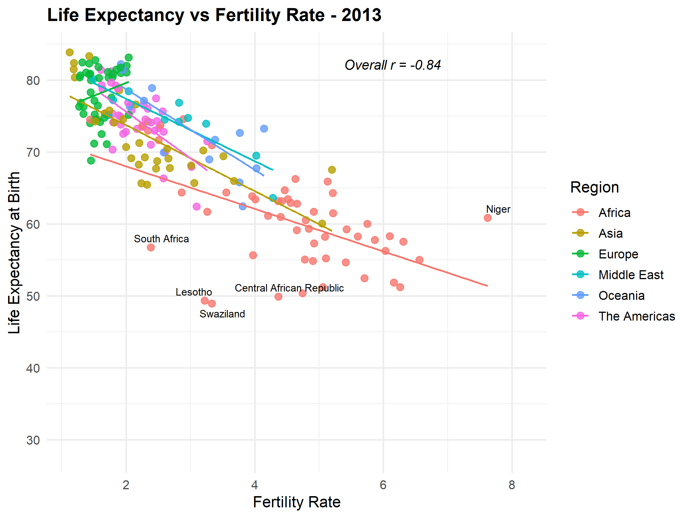

# Fertility-Rate

## Scenario

You are required to produce a scatterplot depicting Life Expectancy (y-axis) and
Fertility Rate (x-axis) statistics by Country.
The scatterplot needs to also be categorised by Countries' Regions.
You have been supplied with data for 2 years: 1960 and 2013 and you are required
to produce a visualisation for each of these years.
Some data has been provided in a csv file, some - in R vectors. The csv file contains
combined data for both years. All data manipulations have to be performed in R (not
in excel) because this project may be audited at a later stage
You have also been requested to provide insights into how the two periods compare.

---

## Data Sources

- `S5-Homework-Data.csv`: Country Name, Country Code, Region, Year, Fertility Rate (1960 & 2013 combined)
- R vectors: Country Code, Life Expectancy at Birth (1960), Life Expectancy at Birth (2013)

The two sources were reshaped and merged in R on `Country.Code` and `Year` to produce a single tidy data frame (`merged_df`) with one row per country per year.

## Visualisations

| 1960 | 2013 |
|---|---|
|  |  |

Each scatterplot shows Fertility Rate (x-axis) against Life Expectancy at Birth (y-axis), colored by Region, with:
- A linear trend line per region
- The 5 largest outliers (by residual from the overall linear fit) labeled by country
- The overall Pearson correlation coefficient annotated on the plot
- Shared axis scales across both years for direct visual comparison

## Insights: 1960 vs 2013

**Overall relationship strengthened.** The correlation between fertility rate and life expectancy went from r = -0.73 in 1960 to r = -0.84 in 2013. The inverse relationship, high fertility associated with lower life expectancy, became more consistent and predictable across countries over the period.

**The entire point cloud shifted up and left.** In 1960, most countries were spread across fertility rates of 2 to 8 with life expectancy ranging roughly 30 to 75. By 2013, the bulk of countries had fertility rates under 4 and life expectancy above 60, indicating a global trend toward smaller families and longer lives.

**Convergence between regions.** In 1960, Africa stood out as a distinct, poorly-fit cluster: high fertility rates (5 to 8) paired with a wide and inconsistent range of life expectancy (28 to 50), and its regional trend line was nearly flat, unlike every other region's negative slope. By 2013, Africa's trend line had steepened to match the negative slope of other regions, though it remained the region with the highest fertility rates and lowest life expectancy overall.

**Europe consistently led on life expectancy.** In both years, Europe occupied the top-left of the plot: the lowest fertility rates paired with the highest life expectancy, and this position was stable across the period, though other regions (Asia, the Americas, Oceania) closed much of the gap by 2013.

**Persistent outliers.** Countries like Sierra Leone, Mali, and Equatorial Guinea were notable low-life-expectancy outliers in 1960; by 2013, the most extreme outliers had shifted to countries like Niger (highest fertility rate in the dataset) and South Africa, Lesotho, and Swaziland, whose life expectancy dropped or lagged well below what their fertility rate alone would predict, plausibly reflecting the impact of the HIV/AIDS epidemic in Southern Africa in the years leading up to 2013.

**Takeaway.** Over the 53-year period, the global relationship between fertility and life expectancy tightened, the average country moved to a lower-fertility, higher-life-expectancy position, and regional disparities, while still present in 2013, narrowed considerably compared to 1960.